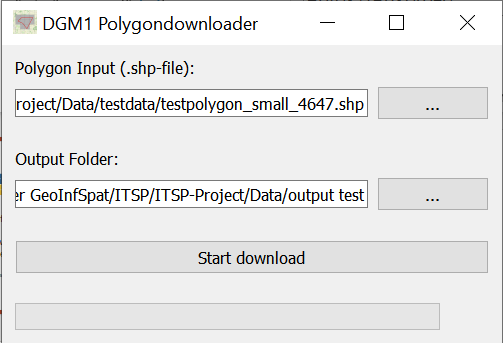

# Polygon Download Tool for LGLN OpenGeoData (DGM1)
**Final Python project for the Introduction to Software Programming course in wintersemester 24/25 at IFGI (University of Münster)**

## Short description of the project
This projects goal is to develop a tool to download DGM1 raster tiles intersecting a polygonal area using the STAC-API by LGLN (State Office for Geoinformation and Land Surveying Lower Saxony). This tool should simplify the download procedure for land consolidation procedure areas at the ArL (Office for Regional Development).
  
### Background and Idea
**Problem:** The raster tile download on the [OpenGeoData download application](https://ni-lgln-opengeodata.hub.arcgis.com/) is only possible for individual tiles or geometries drawn by user, requiring manual downloading of each selected tile. In land consolidation there are very individual areas which often intersect with about 50 tiles. That means first manually digitizing a fitting polygon and then pressing the download-button and selecting the path 50 times.

**Solution:** A tool with an input for polygon data as shapefile, a possibility to choose an output folder and a button to perform an intersection with the raster tiles and download all selected ones to the chosen output path.

### Concept
**Project structure**
- Classes: containing functions for input-processing, API-interaction and download
- GUI: input/output dialog, start/cancel download button, progressbar, messageboxes
- main.py: executes the program



**LGLN STAC-API**

By sending a GET-request with the query-parameters "collections" (dgm1) and "intersects" (GeoJSON-geometry) to the API, the items that intersect the polygon can be selected. To each item is assigned a download URL that can be fetched. 
- STAC-API catalog: https://dgm.stac.lgln.niedersachsen.de/
- API description: https://dgm.stac.lgln.niedersachsen.de/api.html

Example request: https://dgm.stac.lgln.niedersachsen.de/search?collections=dgm1&intersects={"type":"Polygon","coordinates":[[[8.015220969741245,52.73894983444188],[8.061709538545088,52.745983377652394],[8.043666762330364,52.72492794718675],[8.030486479367314,52.73497402662523],[8.015220969741245,52.73894983444188]]]}&limit=500


## How to start the project
**Requirements:**

(Optional: Git)
```bash
# check if Git is installed
git --version
```

Python 3.8 or higher (ensure that pip is installed)
```bash
# check the python version with 
python --version
# or
python3 --version

# check if pip is installed
pip --version
# Install pip
python -m ensurepip
# or update pip
python -m pip install --upgrade pip
```
**Steps:**

With Git: clone the repository and navigate to the project-folder
```bash
# 1.
cd /path/to/targetdirectory 
# 2. 
git clone https://github.com/Juliarotert/ITSP-Project.git
# 3.
cd ITSP-Project
```
Without Git: download the repository from GitHub (green box: <> Code -> Download ZIP) and unzip it
```bash
cd path/to/unzipped/project-folder
```
Set up a virtual environment
```bash
# 4.
pip install virtualenv
# 5. 
python -m venv .venv  
# 6.
.\.venv\Scripts\activate.ps1  
# 6. alternative (depends on terminal)
.\.venv\Scripts\activate
```
Install the dependencies
```bash
# 7.
pip install -r requirements.txt
```
Run in terminal
```bash
python main.py
```
Run in IDE: open main.py or right-click on it and run it